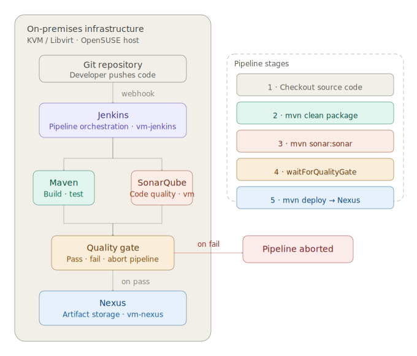

# On-Premises CI/CD Pipeline — Jenkins · Maven · Nexus · SonarQube

A fully self-hosted CI/CD pipeline stack deployed on **KVM/Libvirt** VMs provisioned with **Vagrant**. Replicates in an on-premises environment the kind of pipeline most DevOps courses implement on AWS — with no cloud dependency.

---

## Pipeline Overview

```
Developer pushes code
        │
        ▼
  [ GitHub / GitLab ]
        │
        ▼ Webhook trigger
   [ Jenkins ]
        │
        ├─── Build ──────► [ Maven ]
        │
        ├─── Code Quality ► [ SonarQube ]
        │                      └── Quality Gate (pass/fail)
        │
        └─── Publish ────► [ Nexus ]
                              └── Artifact stored (JAR/WAR)
```

---

## Stack

| Component | Role | Port |
|---|---|---|
| Jenkins | CI orchestration, pipeline execution | 8080 |
| Maven | Java build tool | — |
| Nexus Repository Manager | Artifact storage (releases + snapshots) | 8081 |
| SonarQube | Static code analysis, quality gates | 9000 |

All services run on dedicated Ubuntu 22.04 VMs provisioned via Vagrant on KVM/Libvirt.

---

## Infrastructure

```
Host: OpenSUSE Tumbleweed — KVM/Libvirt
│
├── vm-jenkins      (Ubuntu 22.04 — 2 vCPU / 2GB)
├── vm-nexus        (Ubuntu 22.04 — 2 vCPU / 2GB)
└── vm-sonarqube    (Ubuntu 22.04 — 2 vCPU / 4GB)
```

Jenkins also has Maven installed locally for build execution.

---

## Prerequisites

- OpenSUSE (or any Linux host) with KVM/Libvirt
- `vagrant` + `vagrant-libvirt` plugin
- 8GB+ RAM available

```bash
vagrant plugin install vagrant-libvirt
```

---

## Usage

```bash
git clone https://github.com/roysakai/cicd-onprem-pipeline
cd cicd-onprem-pipeline

# Start all VMs and provision services
vagrant up

# Access the services (after provisioning)
# Jenkins:    http://192.168.23.10:8080
# Nexus:      http://192.168.23.11:8081
# SonarQube:  http://192.168.23.12:9000
```

---

## Pipeline Configuration

### Jenkins Pipeline (Jenkinsfile)

```groovy
pipeline {
    agent any

    tools {
        maven 'Maven-3.9'
    }

    stages {
        stage('Checkout') {
            steps {
                git url: 'https://github.com/YOUR_USERNAME/sample-java-app'
            }
        }

        stage('Build') {
            steps {
                sh 'mvn clean package -DskipTests'
            }
        }

        stage('Code Quality') {
            steps {
                withSonarQubeEnv('SonarQube') {
                    sh 'mvn sonar:sonar'
                }
            }
        }

        stage('Quality Gate') {
            steps {
                timeout(time: 2, unit: 'MINUTES') {
                    waitForQualityGate abortPipeline: true
                }
            }
        }

        stage('Publish to Nexus') {
            steps {
                sh 'mvn deploy -DskipTests'
            }
        }
    }
}
```

---

## Nexus Configuration

- Two repositories configured: `releases` and `snapshots`
- Maven `settings.xml` on the Jenkins VM points to Nexus as the mirror
- Artifacts are versioned and stored after each successful pipeline run

---

## SonarQube Configuration

- Project analysis triggered via Maven plugin during pipeline
- Quality Gate: fails pipeline if code coverage drops below threshold or critical issues are found
- Results visible at `http://192.168.122.12:9000`

---

## Why On-Premises Instead of AWS

Most CI/CD tutorials skip straight to managed AWS services (CodePipeline, ECR, etc.), which hides the underlying mechanics. Running this stack locally means:

- Understanding how each component actually works and integrates
- No cloud costs during learning and experimentation
- A setup that translates directly to enterprise on-premises environments

---

## Project Context

Built as part of a hands-on DevOps learning path. All infrastructure was adapted from course exercises originally designed for AWS — re-implemented entirely on self-hosted KVM VMs. Required solving real service interconnection, firewall, and Java version compatibility challenges.

---

## License

MIT
